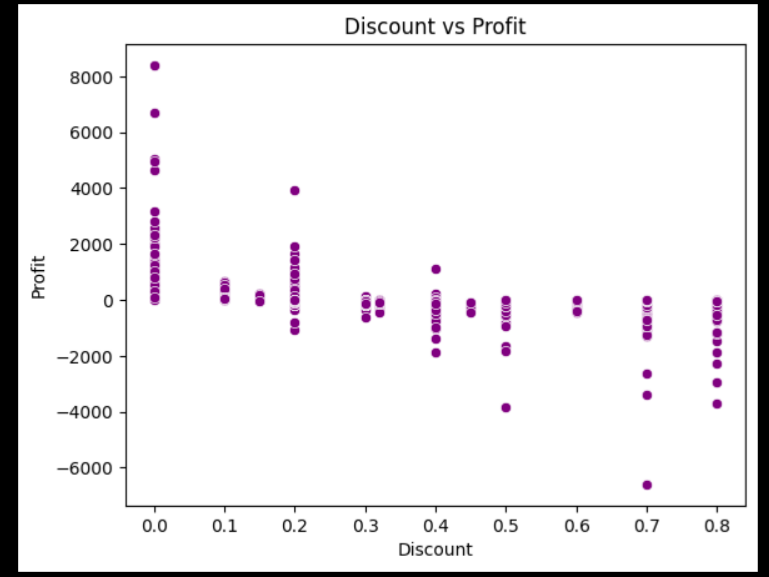
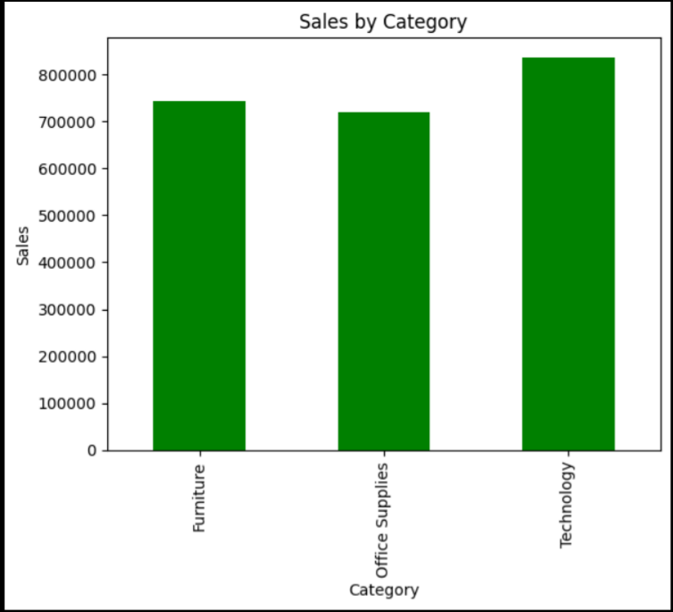
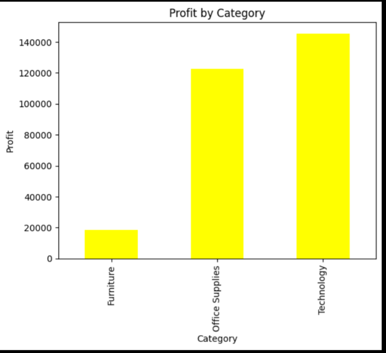
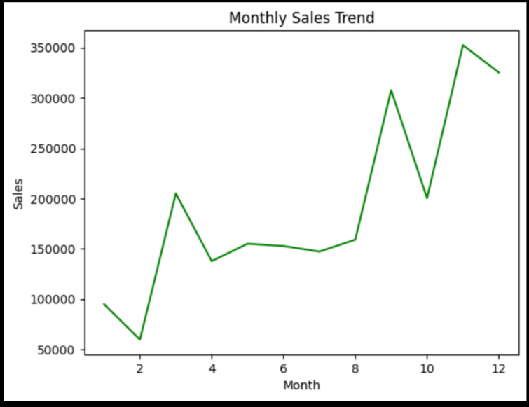
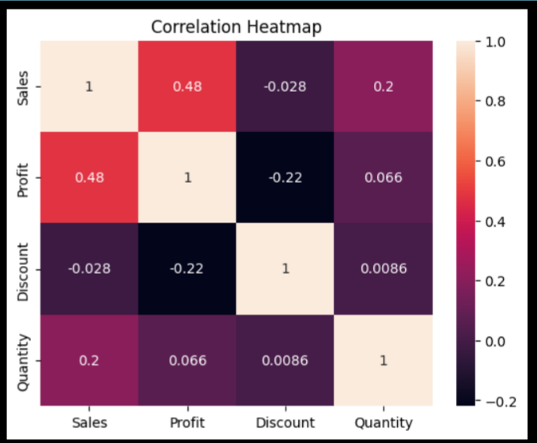
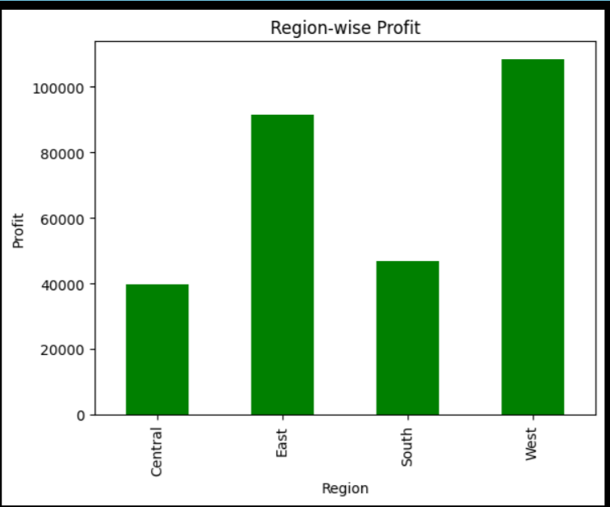
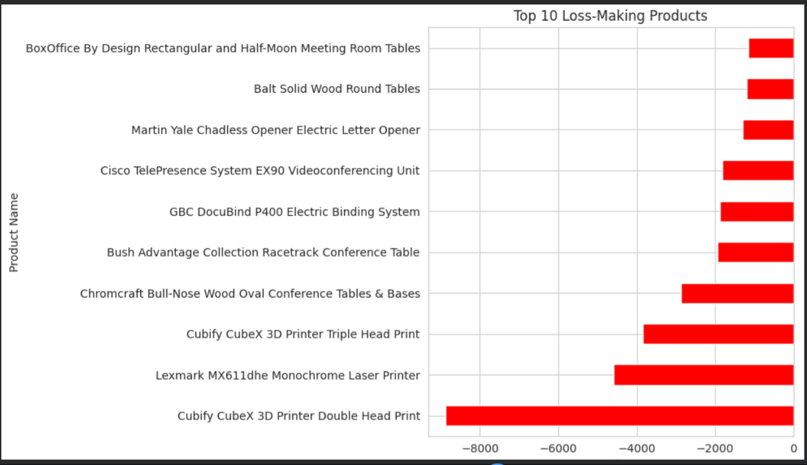

# Profit-Leakage-Analysis-Case-Study
Business case study analyzing profit leakage and discount optimization using Python.
# Profit Leakage & Discount Optimization Analysis




---

## Business Problem

The company uses discount strategies to increase sales, but excessive discounting reduces profitability.

This case study identifies:
- Profit leakage drivers
- Impact of discounts on profit
- High-risk categories
- Loss-making products
- Region-wise business performance

---

## Project Objective

The objective of this analysis is to identify factors causing profit leakage and provide recommendations to improve profitability.

---

## Tools Used

- Python
- Pandas
- Matplotlib
- Seaborn
- Google Colab

---

## Dataset Information

- Superstore Sales Dataset
- 9994 Rows
- 21 Columns

---

## Project Workflow

1. Data Cleaning & Preprocessing  
2. Exploratory Data Analysis (EDA)  
3. Profit Leakage Analysis  
4. Discount vs Profit Analysis  
5. Regional Performance Analysis  
6. Risk Category Identification  
7. Business Recommendations  

---

# Key Analysis

## Sales by Category

Technology generated the highest sales volume.



---

## Profit by Category

Profitability varied across categories.



---

## Discount vs Profit

Higher discounts were associated with lower profitability.


---

## Monthly Sales Trend

Sales performance fluctuated over time, showing seasonal demand patterns and business growth opportunities.



---

## Risk Level by Category

Furniture category showed a higher number of high-risk transactions, indicating pricing inefficiencies and profit leakage risk.


---

## Correlation Heatmap

The heatmap highlights relationships between key business variables such as sales, profit, discount, and quantity.



---

## Region-wise Profit Analysis

Regional profitability varied significantly across business locations.



---

## Top 10 Loss-Making Products

Several products consistently generated losses despite active sales performance.



---

# Key Findings

- High discounts reduce profitability
- Furniture category contains higher business risk
- Several products consistently generated losses
- Regional performance differs significantly
- Excessive discounting is a major driver of profit leakage

---

# Business Recommendations

- Reduce excessive discounts
- Monitor high-risk categories
- Improve pricing strategy
- Review loss-making products
- Focus on profitable regions
- Develop better discount approval mechanisms

---

# Business Impact

This analysis can help businesses:

- Reduce unnecessary discount losses
- Improve pricing decisions
- Identify risky product categories
- Improve regional profitability
- Optimize discount strategies

---

# Project Structure

```bash
Profit-Leakage-Analysis-Case-Study
│
├── Profit_Leakage_Analysis.ipynb
├── Profit_leakage_analysis_report.pdf
├── README.md
│
├── dataset
│   └── Superstore.csv
│
└── screenshots
    ├── sales_by_category.png
    ├── profit_by_category.png
    ├── discount_vs_profit.png
    ├── monthly_sales_trend.png
    ├── correlation_heatmap.png
    ├── risk_level_category.png
    ├── region_profit.png
    └── top_10_loss_making_products.png
```

---

# Future Improvements

- Build an interactive Power BI dashboard
- Add predictive profit modeling
- Implement discount optimization strategies
- Develop automated business risk detection

---

# Conclusion

This case study identified major drivers of profit leakage using Python-based data analysis and visualization techniques.

The analysis highlighted:
- Discount impact on profitability
- High-risk product categories
- Regional performance differences
- Loss-making products
- Business risk patterns

The findings support better pricing, discounting, and profitability decisions.

---

# Author

Anshika Goyal  
Aspiring Data Analyst
